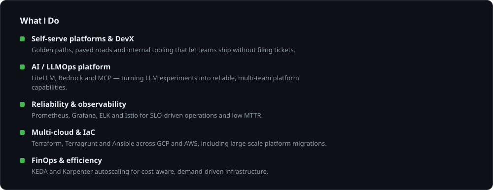
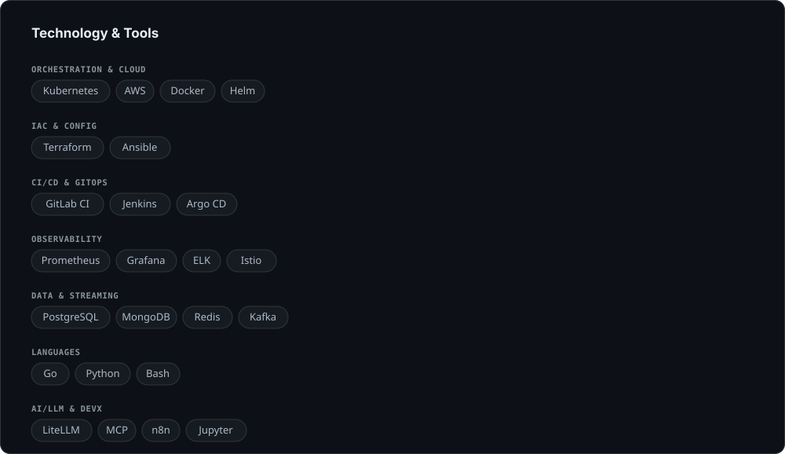
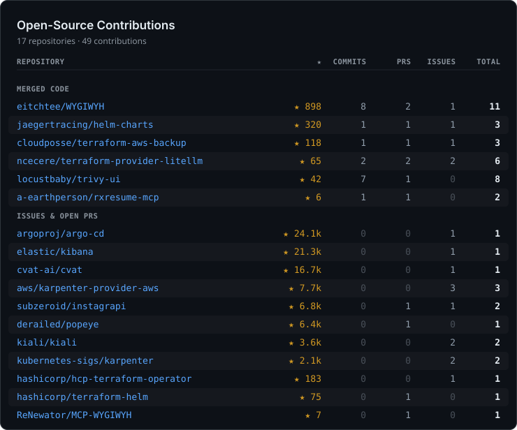

  
  
  

  

 

<!--SPOTLIGHT:START-->

### Open-Source Contributions

<b><a href="https://github.com/argoproj/argo-cd">argoproj/argo-cd</a></b> — ★ 23.8k · 1 issue

- 🐛 [Failed to unmarshal "config.yaml": <nil>](https://github.com/argoproj/argo-cd/issues/21934)

<b><a href="https://github.com/elastic/kibana">elastic/kibana</a></b> — ★ 21.2k · 1 issue

- 🐛 [Disable maximum table cell height for nested table](https://github.com/elastic/kibana/issues/68743)

<b><a href="https://github.com/cvat-ai/cvat">cvat-ai/cvat</a></b> — ★ 16.4k · 1 issue

- 🐛 [Migration of backend data to external storage services (e.g. AWS S3)](https://github.com/cvat-ai/cvat/issues/9211)

<b><a href="https://github.com/aws/karpenter-provider-aws">aws/karpenter-provider-aws</a></b> — ★ 7.7k · 3 issues

- 🐛 [Daemonset Overhead and the number of pods](https://github.com/aws/karpenter-provider-aws/issues/7938)
- 🐛 [Karpenter doesn't update EC2NodeClass status after `Failed to detect the cluster CIDR error`](https://github.com/aws/karpenter-provider-aws/issues/7875)
- 🐛 [NodeClass for GPU nodes and special AMIs](https://github.com/aws/karpenter-provider-aws/issues/7731)

<b><a href="https://github.com/subzeroid/instagrapi">subzeroid/instagrapi</a></b> — ★ 6.6k · 1 PR · 1 issue

- 🐛 [\[BUG\] The `set_settings()` method ignores the `country` key when setting settings from the dictionary ](https://github.com/subzeroid/instagrapi/issues/2065)
- 🔃 [Fix CDN downloads: Use requests with proxy support](https://github.com/subzeroid/instagrapi/pull/2379)

<b><a href="https://github.com/derailed/popeye">derailed/popeye</a></b> — ★ 6.3k · 1 PR

- 🔃 [Improved minio support and updated documentation for running inside the cluster](https://github.com/derailed/popeye/pull/487)

<b><a href="https://github.com/kiali/kiali">kiali/kiali</a></b> — ★ 3.6k · 2 issues

- 🐛 [Don't understand the behavior when forming external service names on the graph when using `ServiceEntry`](https://github.com/kiali/kiali/issues/6314)
- 🐛 [Gateway-API: Istio sidecar container not found in Pod(s)](https://github.com/kiali/kiali/issues/7860)

<b><a href="https://github.com/kubernetes-sigs/karpenter">kubernetes-sigs/karpenter</a></b> — ★ 2.1k · 2 issues

- 🐛 [The behavior related to disruption budget is not clearly explained in the documentation](https://github.com/kubernetes-sigs/karpenter/issues/2218)
- 🐛 [NodeClaim finalizer karpenter.sh/termination it has been stuck and has not been deleted](https://github.com/kubernetes-sigs/karpenter/issues/2169)

<b><a href="https://github.com/eitchtee/WYGIWYH">eitchtee/WYGIWYH</a></b> — ★ 888 · 7 commits · 1 PR · 1 issue

- 🐛 [It seems that Synth is no longer suitable for personal use](https://github.com/eitchtee/WYGIWYH/issues/292)
- 🔀 [feat(api): add API tokens and OAuth2 client support for external integrations](https://github.com/eitchtee/WYGIWYH/pull/557)
- 📝 [7 commits](https://github.com/eitchtee/WYGIWYH/commits?author=obervinov)

<b><a href="https://github.com/jaegertracing/helm-charts">jaegertracing/helm-charts</a></b> — ★ 319 · 1 commit · 1 PR · 1 issue

- 🔀 [\[jaeger\] fix .Values.storage.elasticsearch.tls for es-rollover-hook](https://github.com/jaegertracing/helm-charts/pull/522)
- 🐛 [\[Bug\]: jaeger-chart: does not exist .Values.storage.elasticsearch.tls in es-rollover-hook.yml](https://github.com/jaegertracing/helm-charts/issues/521)
- 📝 [1 commit](https://github.com/jaegertracing/helm-charts/commits?author=obervinov)

<b><a href="https://github.com/hashicorp/hcp-terraform-operator">hashicorp/hcp-terraform-operator</a></b> — ★ 182 · 1 issue

- 🐛 [🤔 Choose when runs should be triggered by VCS changes.](https://github.com/hashicorp/hcp-terraform-operator/issues/314)

<b><a href="https://github.com/cloudposse/terraform-aws-backup">cloudposse/terraform-aws-backup</a></b> — ★ 118 · 1 commit · 1 PR · 1 issue

- 🔀 [Support for additional policy for creating reserial copies of S3 buckets](https://github.com/cloudposse/terraform-aws-backup/pull/89)
- 🐛 [The module does not work with S3 buckets](https://github.com/cloudposse/terraform-aws-backup/issues/88)
- 📝 [1 commit](https://github.com/cloudposse/terraform-aws-backup/commits?author=obervinov)

<b><a href="https://github.com/hashicorp/terraform-helm">hashicorp/terraform-helm</a></b> — ★ 75 · 1 PR

- 🔃 [Add the "resources" specification to sync-workspace-deployment](https://github.com/hashicorp/terraform-helm/pull/72)

<b><a href="https://github.com/ncecere/terraform-provider-litellm">ncecere/terraform-provider-litellm</a></b> — ★ 60 · 2 commits · 2 PRs · 2 issues

- 🔃 [feat(team-member): add budget_duration; team: add team_member_budget_duration](https://github.com/ncecere/terraform-provider-litellm/pull/113)
- 🔀 [Fix: send explicit null to clear team budget and nullable fields](https://github.com/ncecere/terraform-provider-litellm/pull/104)
- 🐛 [litellm_team_member budgets never reset: budget_duration has no effect without budget_reset_at](https://github.com/ncecere/terraform-provider-litellm/issues/112)
- 🐛 [Unable to clear team max_budget and budget_duration back to null (unlimited)](https://github.com/ncecere/terraform-provider-litellm/issues/99)
- 📝 [2 commits](https://github.com/ncecere/terraform-provider-litellm/commits?author=obervinov)

<b><a href="https://github.com/locustbaby/trivy-ui">locustbaby/trivy-ui</a></b> — ★ 39 · 7 commits · 1 PR

- 🔀 [Support for running inside kubernetes](https://github.com/locustbaby/trivy-ui/pull/1)
- 📝 [7 commits](https://github.com/locustbaby/trivy-ui/commits?author=obervinov)

<b><a href="https://github.com/ReNewator/MCP-WYGIWYH">ReNewator/MCP-WYGIWYH</a></b> — ★ 7 · 1 PR

- 🔃 [Add optional OAuth 2.1 / DCR support (client side of WYGIWYH #557)](https://github.com/ReNewator/MCP-WYGIWYH/pull/1)

<b><a href="https://github.com/a-earthperson/rxresume-mcp">a-earthperson/rxresume-mcp</a></b> — ★ 6 · 1 commit · 1 PR

- 🔀 [ci: build multi-arch docker image (amd64 + arm64)](https://github.com/a-earthperson/rxresume-mcp/pull/7)
- 📝 [1 commit](https://github.com/a-earthperson/rxresume-mcp/commits?author=obervinov)

<b></b> — 32 PRs · 1 issue · 9 reviews

- 🔃 
- 🔃 
- 🔃 
- 🔃 
- 🔃 
- 🔃 
- 🔃 
- 🔃 
- 🔃 
- 🔃 
- 🔃 
- 🔃 
- 🔃 
- 🔃 
- 🔃 
- 🔃 
- 🔃 
- 🔃 
- 🔃 
- 🔃 
- 🔃 
- 🔃 
- 🔃 
- 🔃 
- 🔃 
- 🔃 
- 🔃 
- 🔃 
- 🔃 
- 🔃 
- 🐛 
- 👀 
- 👀 
- 👀 
- 👀 
- 👀 
- 👀 
- 👀 
- 👀 
- 👀 
- 🔃 
- 🔃 

<!--SPOTLIGHT:END-->
